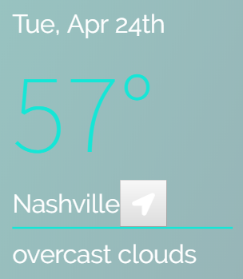

# Fanatic 

Fanatic is a Wake Up App created by the Developers and UX Designers at Cock-A-Doodle-Doo.

## Summary

Your group will create a Single Page Application that is essentially a dashboard for a user to use when they wake up in the morning to keep track of the weather, news, and their favorite sports headlines.

# MVP Goals
1. Create a ReadMe with details on each function throughout the product. Each function in each component will be documented inside the readme for future programming. Images and videos are expected.
1. Using the persona from the Cock-a-Doodle-Do dashboard project, we are gearing our new product toward a sports-enthused individual who, with his busy schedule for work and other responsibilities, wants to stay in-the-know with his favorite sports headlines. 
1. Create a single-page, mobile-first application using Sports, Weather and News APIs to render the application when the user wakes up every morning.
1. Technology to use: React.js (create-react-app, re-base, react-router), Reactstrap (CSS framework), and Firebase for data storage and retrieval.
1. Commentary on each function to allow anyone to come in, read the components, and understand what each function does.

# Stretch Goals
1. Allow the user to press and hold an API section and move it anywhere on the screen to better fit their lifestyle. 
1. Future planning for other APIs to be included.
1. Add in the Spotify API to allow the user to play a song from their current / favorite playlist.

# How to view this app
1. This app is compiled with React JS. In order to view this application, you must 'npm install' in the folder where the package.json file is compiling other files. 
1. Once you have installed dependencies, you must 'npm start'.
1. Log in with Google on the top left corner of Fanatic.
1. The User may now update their zipcode for weather, their favorite NHL team for sports headlines, and see top 10 trending technology stories in the US.
1. To save a favorite article, click on the star on the bottom right corner or any article card.
1. You may log out at the top left corner of the application.

# React JS File Components

## News (mvp)
1. 'class News extends Component'
    - the constructor function creates the state object for the NewsAPI results. 
    - the state object includes a false value for 'newsLoaded', an empty array for the object result and a null error.
    - the componentDidMount function calls the getNews function.
    - getNews() fetched the top headlines of the us in the technology category, then puts the results into a json file through the (res => res.json()) code.
    - Then, result is loaded into the setState object which pulls the json results.
    
    - The Fanatic objResult pulls the exact object without any excess info.

1. The render() grabs the state object inside of the constructor and redners the object result (objResult). 
    
1. An if else if statement is used to render an Error message (if error), a Loading message (if not loaded), or the newsArticles inside reactstrap Cards. 
1. newsArticles is a variable set to loop through the results using the .map() function, which adds a permanent and unique ID to every element in the objResult array.
1. Information rendering include:
    1. image
    1. title
    1. description
    1. source name

## Weather (mvp)
    
1. Start with Nashville Weather (37216)
1. Card displays 
    - Current Date
    - Current Temp
    - Location
    - Change Location Button
    - Weather Condition
1. Let user save their prefered zipcode in modal popup from locaiton button. Shows on app and syncs to Firebase.
1. When the user returns their prefered zipcode will be saved to their login.

## Sports (mvp)
1. componentDidMount calls the function (getHockeyMain), which fetches from my API. 
1. It changes the state if it is loaded effectively and an if statement determines if the team won or lost, as well as if they are the home or away team.
    
1. That same function formats the jsx version of the score and a W or L depending on if they won or not
1. Fanatic is set up to start with Nashville as their favorite team, but if the button is clicked, the getAnotherClicked() runs the "updateTeam(team) function which retrieves the team value to plug into the API url, as well as pushing the favorite team to firebase.

